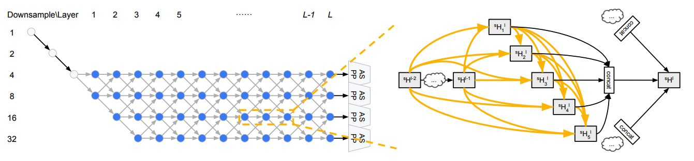
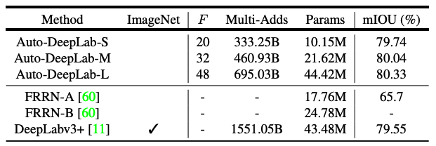
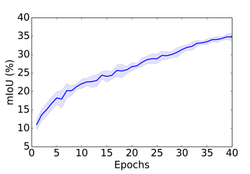
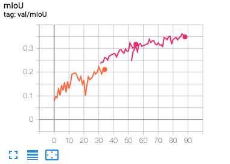

# AutoML for Image Segmentation and Detection
This is an open-source project of AutoML for object detection & segmentation as well as semantic segmentation.

Currently this repo contains a pytorch implementation for [Auto-Deeplab](https://arxiv.org/abs/1901.02985). 


Following the popular trend of modern CNN architectures having a two level hierarchy. Auto-Deeplab forms a dual level search space, searching for optimal network and cell architecture.



Auto-Deeplab acheives a better performance while minimizing the size of the final model.


<br/><br/>

From the auto-deeplab paper |  Our half-sized model takes twice as long to train
:---------------------------------------:|:-------------------------:
 | 

***For half-sized model, set --filter_multiplier 4 --resize 358 --crop_size 224***
<br/><br/>
***For full-sized model, leave parameters to their default setting***
<br/><br/>

## Training 

***Begin Architecture Search***

**Start Training**
```
CUDA_VISIBLE_DEVICES=0 python train_autodeeplab.py --dataset cityscapes
```

**Resume Training**
```
CUDA_VISIBLE_DEVICES=0 python train_autodeeplab.py --dataset cityscapes --resume /AutoDeeplabpath/checkpoint.pth.tar
```

**Multi-GPU Training**
```
CUDA_VISIBLE_DEVICES=0,1 python train_autodeeplab.py --dataset cityscapes --batch_size 2
```

***Once you are done training it's time to decode the search space and find your new architecture***


**Load and Decode**
```
CUDA_VISIBLE_DEVICES=0 python decode_autodeeplab.py --dataset cityscapes --resume /AutoDeeplabpath/checkpoint.pth.tar
```

***Once the decoding stage is finished its time to load your new architecture and train your new optimal model***


**Build and Train new model**
```
CUDA_VISIBLE_DEVICES=0 python train_new_model.py --dataset cityscapes --saved_arch_path /AutoDeeplabpathtosaveddecodings/
```
## Requirements

* Pytorch version 1.1

* Python 3

* tensorboardX

* torchvision

* pycocotools

* tqdm

* numpy

* pandas

## References
[1] : [Auto-DeepLab: Hierarchical Neural Architecture Search for Semantic Image Segmentation](https://arxiv.org/abs/1901.02985)

[2] : [pytorch-deeplab-xception](https://github.com/jfzhang95/pytorch-deeplab-xception)

[3] : [Some code for the project was taken from here](https://github.com/MenghaoGuo/AutoDeeplab)